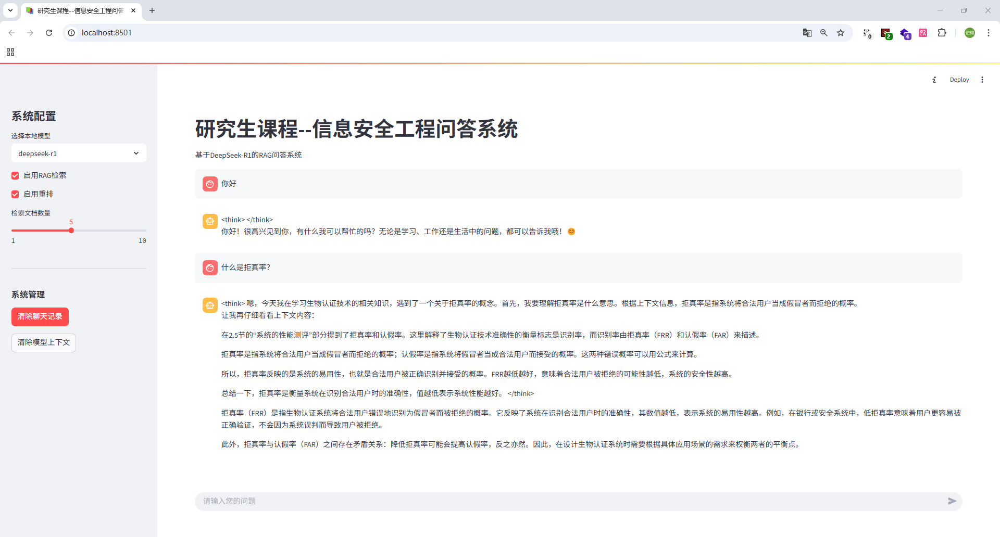

# 课程问答系统（施工中，上完这学期的课再submit all）

这是一个基于ollama+本地知识库+RAG的问答系统，适用于本科和研究生的课程作业，使用的时候务必将相关信息进行修改！




## 安装要求

1. 安装Python依赖：(建议就是虚拟环境或者啥的)   由于这个项目还有其他的东西，导致库文件有点多，看着来删就可以了。懒得去理了。
```bash
pip install -r requirements.txt
```

2. 
```bash
# 确保Ollama服务已安装并运行：
ollama serve
```

## 项目结构

```
.
├── config/                # 配置信息
│   └── settings.py       # 具体配置文件
├── data/                  # 课程资料目录
│   ├── ppts/              # PPT文件
│   ├── markdown/          # markdown文件
│   └── pdfs/              # PDF文件
├── vector_store/          # 向量存储目录
├── document_processor.py  # 文档处理模块
├── vector_store.py        # 向量存储模块
├── rag_qa.py              # RAG问答系统
├── app.py                 # Web界面
└── requirements.txt       # 项目依赖，
```

## 配置说明

### 1. 模型配置（必选）

在 `config/settings.py` 中修改 `MODEL_CONFIG`：

```python
MODEL_CONFIG = {
    "local_models": {
        "deepseek-r1":"deepseek-r1:7b",  # 左侧是显示名称，右侧是Ollama中的模型名称,可以把多余的模型配置删除掉
        "qwen2.5-7b-instruct": "yasserrmd/Qwen2.5-7B-Instruct-1M:latest",
        "gemma3-4b": "gemma3:4b",
        "qwen2.5-coder": "qwen2.5-coder:3b"
    }
}
```

查看本地Ollama模型列表：
```bash
ollama list
```

如果没有安装的话，可以去https://ollama.com/library 进行拉取

嫌麻烦可以直接搞个deepseek-r1:7b就够了，因为我们是课程嘛，而且有本地知识库，直接小模型即可，本地也跑得通！
```bash
ollama pull deepseek-r1:7b
```

### 2. 向量存储配置（必选）

在 `config/settings.py` 中修改 `VECTOR_STORE_CONFIG`：

```python
VECTOR_STORE_CONFIG = {
    "index_path": VECTOR_STORE_DIR / "faiss_index.pkl",
    "embedding_model": "bge-m3:latest",  # 嵌入模型名称
    "reranker_model": "linux6200/bge-reranker-v2-m3:latest",  # 重排模型名称
    "search_k": 5,  # 检索返回的文档数量
    "dimension": 1024,  # bge-m3的嵌入维度
    "base_url": "http://localhost:11434"  # Ollama API地址
}
```

确保已下载所需的嵌入模型和重排模型：
```bash
ollama pull bge-m3:latest
ollama pull linux6200/bge-reranker-v2-m3:latest
```

### 3. RAG配置（可选）

在 `config/settings.py` 中修改 `RAG_CONFIG`：

```python
RAG_CONFIG = {
    "chunk_size": 1000,  # 文本分块大小
    "chunk_overlap": 200,  # 文本分块重叠大小
    "context_window": 4000,  # 上下文窗口大小
    "use_reranker": True  # 是否使用重排
}
```

## 使用方法

### 1. 准备数据

将课程资料放入对应目录：
- PPT文件放入 `data/ppts/` 目录
- PDF文件放入 `data/pdfs/` 目录
- markdown文件放入 `data/markdown/` 目录

### 2. 首次运行流程

1. 确保所有配置文件已正确修改
2. 确保Ollama服务正在运行
3. 初始化向量数据库
```bash
python initialize.py
```
显示初始化完成，且vector_store文件夹下面多了一个*.pkl即为初始化成功！
4. 运行Web界面：
```bash
streamlit run app.py
```
